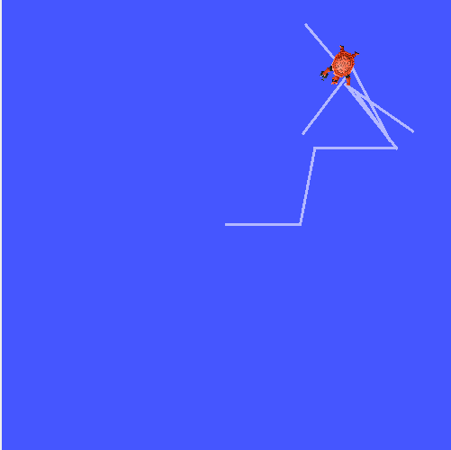

# Day 2 - Turtlesim & Core Concepts 
Date: 2026-06-23

## What I Learned
- Nodes, Topics, Messages
- Publish/Subscribe model
- ROS 2 CLI tools (`ros2 node`, `ros2 topic`, `ros2 service`, etc.)
- Creating a basic workspace + package

## What I Did
- Ran turtlesim + teleop
- Explored ROS 2 graph using CLI
- Created first package `my_first_package`
- Built and sourced workspace

## Screenshots

## Next Day Plan (Day 3)
- Write custom publisher and subscriber nodes